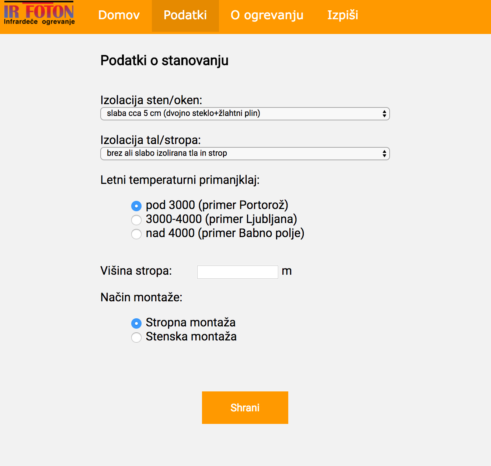
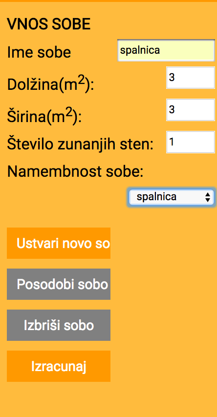
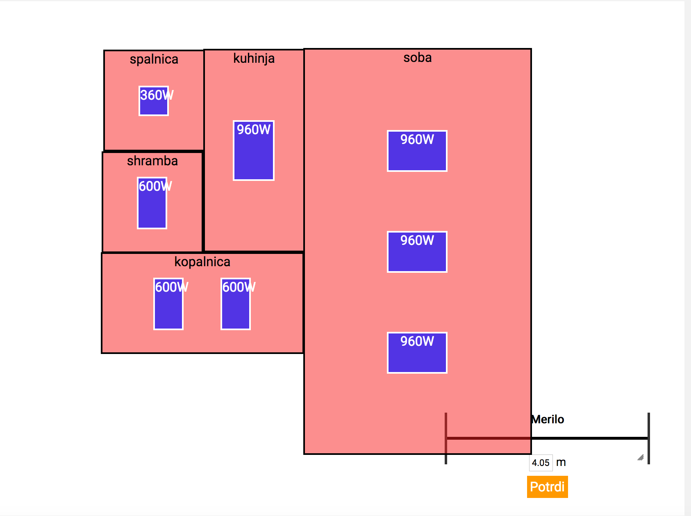

Kako si izdelati načrt postavitve panelov:
===========================================

Za izračun je potrebno:

1) **Vpis podatkov**

 Vpišite poatke stanovanja, ki se bodo uporabili pri izračunu.

2) **Naložiti tloris**

V zavihku Domov naložite tloris stanovanja, da boste lahko načrtali:

3) **Vnos merila**

Vnesite merilo ene od sob v metrih.

.. image:: ../vnos-merila.png

4) **Vnos podatkov posamezne sobe**

Vpišite potrebne podatke sobe in kliknite Ustvari novo sobo.

5) **Urejanje/brisanje sobe**

Z gumbi Posodobi in briši sobo lahko urejate podatke sobe ki je kliknjena ali jo lahko izbrišemo.

.. image:: ../gumbi.png

6) **Izris predlaganih panelov**

Ob kliku na gumb izriši se vam bo na podlagi vpisanih podatkov predlagala postavitev panelov.

